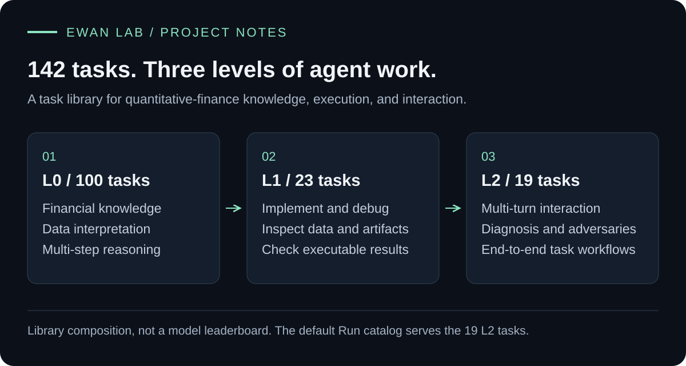
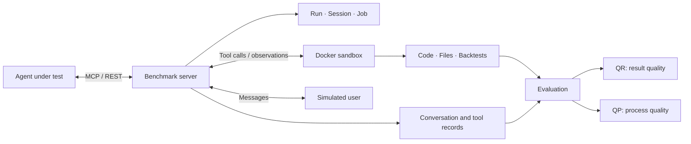
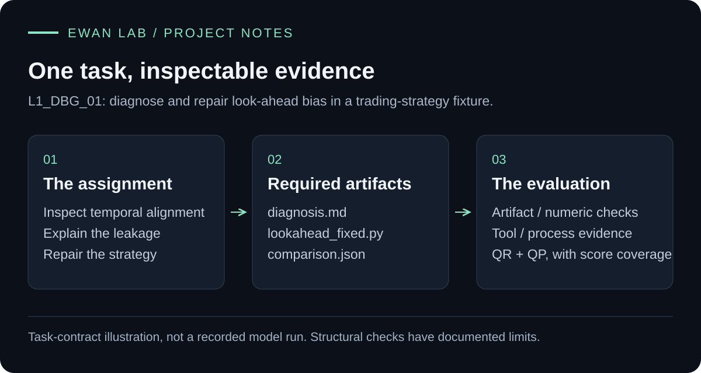

<div align="center">

# Quantitative Finance Agent Benchmark

**Evaluate agents through their actions, artifacts, and results.**

An execution and evaluation environment for quantitative-finance agents, with sandboxed tools, multi-turn tasks, and evidence-based scoring.



[](https://github.com/Syx403/quantitative-finance-agent-benchmark/actions/workflows/tests.yml)


[Quick start](#quick-start) · [Architecture](docs/architecture.md) · [Evaluation](docs/evaluation.md) · [Tasks](docs/tasks.md) · [Simulator study](bench/experiments/user_sim_stability/README.md)

</div>

---

An agent working on a trading strategy may need to inspect data, write code, diagnose a failed backtest, revise its approach, and explain the result. A final answer alone cannot show whether those steps actually worked.

This project provides the task environment, captures tool activity and artifacts, and evaluates both **result quality (QR)** and **process quality (QP)**. It began as an evaluation system for a quantitative-finance tutor and developed into a reusable client–server benchmark.

## What is inside

| Area | Implementation |
| --- | --- |
| **Agent execution** | An SDK-driven baseline client; external agents connect through MCP or REST. |
| **Sandboxed tools** | Docker workspaces, read-only input mounts, configurable network/resource limits, Python analysis, and optional LEAN/C# backtesting. |
| **Run management** | Run/Session/Job state, execution and control tokens, asynchronous tool jobs, and saved session state. |
| **Evaluation** | Artifact validators, code and tool checks, rubric-based LLM judges, and explicit handling of missing scores. |
| **Task library** | 100 knowledge tasks, 23 tool-execution tasks, and 19 multi-turn tasks. |
| **Reliability study** | A separate simulated-student experiment with persona contracts, repeated runs, multi-judge analysis, and human alignment. |

## How it works



The agent chooses its next action. The server enforces the environment and access boundaries. Evaluation runs separately from the agent's task tools.

## One task, from diagnosis to evidence

An example task asks an agent to repair **look-ahead bias** in a strategy. It must
explain the temporal-alignment problem, produce corrected Python code, and write a
comparison of original and corrected metrics. The evaluator inspects the required
artifacts alongside execution and process evidence.



This figure illustrates an existing **task contract**, not a new model run or a
performance claim. [Read the annotated case](docs/lookahead-case.md) for the actual
output contract, check boundaries, and code entry points.

## Quick start

### 1. Install

Use Python 3.11 or later. The CI environment uses Python 3.11.

```bash
git clone https://github.com/Syx403/quantitative-finance-agent-benchmark.git
cd quantitative-finance-agent-benchmark
python3 -m venv .venv
source .venv/bin/activate
python -m pip install -r requirements-dev.txt
```

### 2. Explore without API keys

```bash
# Validate the task definitions and inspect the catalog.
python scripts/check_catalog.py

# Run the offline unit and API tests; outbound network calls are blocked.
python -m pytest -q

# Inspect the simulator experiment size without generating conversations.
PYTHONPATH=bench python -m experiments.user_sim_stability.cli dry-run
```

No LLM calls or Docker daemon are needed for these commands. Tests use isolated temporary workspaces and mocked external services.

### 3. Run an agent

Live sessions require model credentials, task data, and the appropriate Docker image. Follow the [running guide](docs/running.md) for the server, baseline client, and external-agent connection flow.

```bash
cp .env.example .env
# Add your own OPENROUTER_API_KEY to .env.

docker build -f bench/docker/Dockerfile \
  -t quant-bench-env:v3.0 -t quant-tutor-env:v2.2 bench

PYTHONPATH=bench python -m server --host 127.0.0.1 --port 8000 --docker
```

The server exposes a local dashboard at `http://127.0.0.1:8000`, a health endpoint at `/health`, and MCP at `/mcp`.

## Read the code by capability

| Start here | What to look for |
| --- | --- |
| [`bench/client/`](bench/client) | Agent loop integration, transports, context handling, and tool-result capture. |
| [`bench/server/core/`](bench/server/core) | Sandbox setup, tool dispatch, execution records, and simulated-user interaction. |
| [`bench/server/run/`](bench/server/run) | Run lifecycle, job state, token binding, and persistence. |
| [`bench/eval/`](bench/eval) | Independent evaluation contracts, QR/QP scoring, judges, and result storage. |
| [`bench/tasks/`](bench/tasks) | Task definitions, expected outputs, and task-specific verification code. |
| [`bench/experiments/user_sim_stability/`](bench/experiments/user_sim_stability) | Simulator reliability experiment and analysis pipeline. |

Three useful engineering examples are [tool failure classification](bench/server/core/proxy.py), [missing-score handling](bench/eval/core/scoring.py), and [incremental tool-result capture](bench/client/adapters/anthropic_adapter.py).

## Scope

This is a research and engineering prototype. The 142-task count describes the library, not a completed leaderboard across every model. The default public Run catalog serves the 19 L2 tasks; the reference task-suite adapter also loads L0 and L1 definitions.

Docker mode provides container isolation. Local execution mode does not provide the same boundary. LLM scores, saved traces, and structural checks each have limits, described in the [evaluation guide](docs/evaluation.md).

## Acknowledgments

Originally developed collaboratively at Varsity Tech. This curated repository is maintained by [Syx403](https://github.com/Syx403) and preserves contributions from Rick Chan and the original team. See [NOTICE](NOTICE.md) for source provenance and third-party attribution.

This edition makes the retained implementation, task catalog, offline checks, and
documentation available together. The current Git history is a curated snapshot;
it should not be read as sole authorship of the original system. Module-level
personal contribution claims are intentionally not inferred from that import.

## Reuse and licensing

The repository is available for inspection. A project-wide open-source license has
not been selected; public visibility is not a blanket license to redistribute
third-party task material or dependencies. See [NOTICE](NOTICE.md) for the retained
source and data boundaries.
