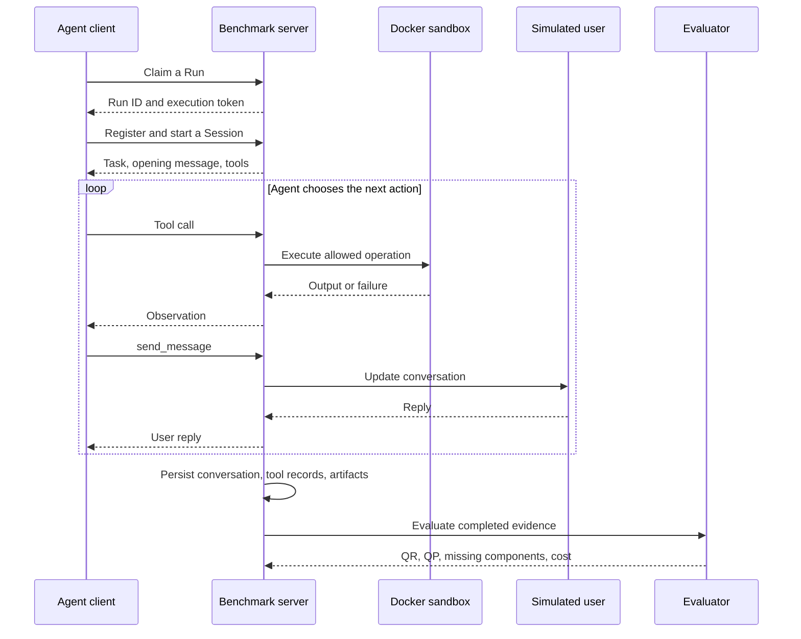

# Architecture

[Back to the project](../README.md)

The system separates the **agent's decision loop**, the **execution environment**, and the **evaluation pipeline**. An external agent can use the environment without adopting the baseline client.

## A task from assignment to score

Tool calls and messages can occur in different orders. The diagram shows the responsibilities, not a mandatory sequence for every task.

## Components

| Component | Responsibility | Main entry points |
| --- | --- | --- |
| Client | Model calls, tool feedback, context management, and trace capture | [`runner.py`](../bench/client/runner.py), [`anthropic_adapter.py`](../bench/client/adapters/anthropic_adapter.py) |
| Protocol layer | REST/MCP dispatch, credentials, phase checks, and responses | [`http_app.py`](../bench/server/api/http_app.py), [`protocol.py`](../bench/server/api/protocol.py) |
| Session runtime | Workspace, tools, user interaction, and completion | [`session_api.py`](../bench/server/api/session_api.py), [`session.py`](../bench/server/core/session.py) |
| Sandbox | Container lifecycle, input mounts, resource limits, tool executor | [`container.py`](../bench/server/core/container.py), [`tool_executor.py`](../bench/server/core/tools/tool_executor.py) |
| Run management | Assignment, ownership, execution/control credentials, state | [`service.py`](../bench/server/run/service.py), [`jobs.py`](../bench/server/run/jobs.py) |
| Reference bundle | Maps quantitative-finance tasks onto the platform contracts | [`task_suite.py`](../bench/server/reference/task_suite.py), [`evaluator.py`](../bench/server/reference/evaluator.py) |
| Evaluation | Consumes saved evidence and computes scores independently | [`score.py`](../bench/eval/score.py), [`coordinator.py`](../bench/eval/core/coordinator.py) |

## Run, Session, and Job

**Run** represents an assigned benchmark attempt and its overall status. Execution credentials bind to the Run; separate control credentials support monitoring and cancellation.

**Session** contains the active interaction: task, persona, conversation, tool records, workspace, and execution phase.

**Job** represents one asynchronous tool operation. Heavy REST operations can return a job identifier for polling. This does not imply that every MCP tool uses the same polling contract.

Saved session state can be restored, but an interrupted operating-system process cannot simply be reconstructed from a conversation. Lost workers are handled separately from restored interaction state.

## Boundaries that matter

- **Reasoning vs. execution:** the model proposes tool calls; the server validates and executes them.
- **Container vs. host:** core tools are dispatched to a persistent executor in Docker mode. Workspace writes and input mounts have different permissions.
- **Concurrency vs. consistency:** a Session lock protects shared state; a process-wide semaphore bounds heavy tool concurrency.
- **Working context vs. records:** context compaction may remove earlier messages. Incremental capture preserves tool results separately, with output-size limits.
- **Agent vs. evaluator:** public task tools do not grant evaluation-management privileges.
- **Termination vs. success:** a completed Session can have stopped because of a limit. The termination reason and task score answer different questions.

## Storage

Run and Session state, conversations, workspace artifacts, and versioned evaluation records are stored on disk. Score allocation uses file locking. Some state files and indexes are updated in place: this is not an immutable event store or a distributed transaction system.

The repository includes a local dashboard for inspecting runs and results. Generated workspaces, credentials, model outputs, and caches are excluded from Git.
